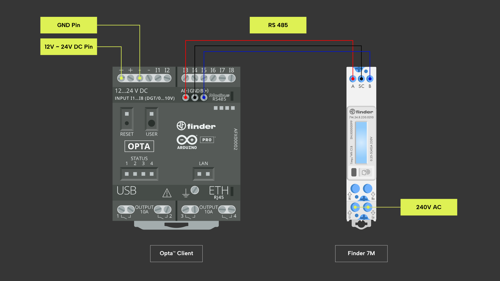

## Panoramica

Tra i protocolli supportati da Opta™, troviamo Modbus RTU. In questo tutorial
impareremo a implementare la comunicazione Modbus RTU su RS-485 tra Opta™ e un
misuratore di energia Finder 7M. In particolare, impareremo a convertire i
valori letti dai registri del 7M in valori floating point e a caricarli su
Arduino Cloud.

## Obiettivi

* Imparare a stabilire la connettività dell'interfaccia RS-485 tra i
  dispositivi Opta™ e Finder 7M.
* Imparare a utilizzare il protocollo di comunicazione Modbus RTU per leggere i
  registri del 7M.
* Imparare a convertire i valori codificati in floating point.
* Imparare a caricare le letture di energia del 7M su Arduino Cloud.

## Requisiti Hardware e Software

### Requisiti Hardware

* PLC Opta™ con supporto RS-485 (x1).
* Misuratore di energia Finder 7M (x1).
* Alimentatore DIN rail 12VDC/1A (x1).
* Cavo USB-C® (x1).
* Cavo per la connettività RS-485 con una delle seguenti specifiche (x3):
  * STP/UTP 24-18AWG (non terminato) con resistenza di 100-130Ω
  * STP/UTP 22-16AWG (terminato) con resistenza di 100-130Ω

### Requisiti Software

* [Arduino IDE 1.8.10+](https://www.arduino.cc/en/software), [Arduino IDE
2.0+](https://www.arduino.cc/en/software) o [Arduino Web
Editor](https://create.arduino.cc/editor).
* Se si utilizza Arduino IDE offline, è necessario installare le librerie
  `ArduinoRS485` e `ArduinoModbus` utilizzando il Library Manager di Arduino
  IDE.
* Sarà necessario utilizzare [Arduino
  Cloud](https://create.arduino.cc/iot/things) per memorizzare le letture
  dell'energia del 7M tramite Wi-Fi®, utilizzando lo sketch fornito nella
  sezione successiva. È anche possibile utilizzare una connessione Ethernet per
  sfruttare le applicazioni Arduino Cloud. Per accedere alle funzionalità
  Arduino Cloud è necessario creare un account gratuito.
* [Codice di esempio](assets/Opta7MExample.zip).

## Finder 7M e il protocollo Modbus

I misuratori di energia Finder 7M forniscono accesso a una serie di *input
registers* (registri in sola lettura) tramite il protocollo di comunicazione
Modbus RTU su connessione seriale RS-485.

Come specificato nel documento [Modbus communication protocol
7M](https://cdn.findernet.com/app/uploads/2021/09/20090052/Modbus-7M24-7M38_v2_30062021.pdf),
qualsiasi misura accessibile dal display del 7M è disponibile anche su Modbus
tramite una serie di letture a 16 bit: ad esempio, il contatore di energia E1 è
disponibile come un valore a 32 bit ottenuto combinando la lettura dei due
registri a 16 bit situati agli offset 406 e 407. Si noti che tutti gli offset
sono *register offset* e non *byte offset*.

Per ulteriori informazioni sul protocollo di comunicazione Modbus, dai
un'occhiata a questo [articolo su
Modbus](https://docs.arduino.cc/learn/communication/modbus): tutte le
funzionalità fornite dalla libreria `ArduinoModbus` sono supportate da Opta™.

## Istruzioni

### Configurazione dell'Arduino IDE

Per seguire questo tutorial, sarà necessaria [l'ultima versione dell'Arduino
IDE](https://www.arduino.cc/en/software). Se è la prima volta che configuri
l'Opta™, dai un'occhiata al tutorial [Getting Started with
Opta™](/tutorials/opta/getting-started).

Assicurati di installare l'ultima versione delle librerie
[ArduinoModbus](https://www.arduino.cc/reference/en/libraries/arduinomodbus/) e
[ArduinoRS485](https://www.arduino.cc/reference/en/libraries/arduinors485/),
poiché verranno utilizzate per implementare il protocollo di comunicazione
Modbus RTU. Inoltre, installa la libreria
[ArduinoIoTCloud](https://www.arduino.cc/reference/en/libraries/arduinoiotcloud/),
necessaria per caricare i dati su Arduino Cloud.

### Connessione tra Opta™ e Finder 7M

Per avere dei dati da caricare su Arduino Cloud, è necessario collegare il
misuratore di energia Finder 7M alla rete elettrica e fornire un carico
adeguato ad essere alimentato tramite i connettori di uscita a 240V (ad esempio
una lampada). Utilizza l'alimentatore da 12VDC/1A per alimentare l'Opta™ e
assicurati di configurare correttamente la connessione seriale RS-485 tra
l'Opta™ e il 7M. Durante la connessione tramite interfaccia RS-485 del tuo
dispositivo Opta™ al misuratore di energia Finder 7M puoi fare riferimento al
diagramma sottostante.



Per far funzionare il codice di esempio, è necessario configurare i seguenti
parametri di comunicazione del 7M:

* Indirizzo Modbus `2`.
* Baudrate `19200`.
* Configurazione seriale `8-N-1`.

Ciò può essere fatto con facilità utilizzando [l'applicazione
Toolbox](https://play.google.com/store/apps/details?id=com.findernet.ToolboxNFC)
tramite NFC.

### Panoramica del codice

Lo scopo del seguente esempio è leggere alcuni valori dal Finder 7M tramite
Modbus e stamparli su console seriale per il debug. Inoltre, il valore del
contatore di energia E1 verrà caricato su Arduino Cloud.

Il codice completo dell'esempio è disponibile [qui](assets/Opta7MExample.zip):
dopo aver estratto i file, lo sketch può essere compilato e caricato
sull'Opta™.

Si noti che il file `thingProperties.h`, generato da Arduino Cloud durante la
configurazione del pannello di controllo, è stato leggermente modificato per
leggere l'SSID e la password WiFi dal file `config.h`:

```cpp
#define WIFI_SECRET_SSID      "YOUR SSID"
#define WIFI_SECRET_PASSWORD  "YOUR PASSWORD"

// Read from the 7M every 10 seconds
#define READ_INTERVAL_SECONDS 10

// Use WiFi to connect to Arduino Cloud
#define ARDUINO_CLOUD_USE_WIFI    1
```

### Lettura dal 7M

I seguenti header sono necessari per abilitare il protocollo Modbus RTU, la
connessione con Arduino Cloud e per importare la funzione matematica `pow()` di
cui avremo bisogno in seguito.

Il file `finder-7m.h` contiene tutte le definizioni necessarie, come i
parametri Modbus e gli offset dei registri.

```cpp
#include <ArduinoModbus.h>
#include <ArduinoRS485.h>
#include <ArduinoIoTCloud.h>
#include <math.h>
#include "finder-7m.h"
#include "config.h"
#include "thingProperties.h"

const uint8_t MODBUS_7M_ADDRESS = 2;

void setup()
{
    Serial.begin(9600);

    digitalWrite(LEDG, HIGH);
    digitalWrite(LEDB, HIGH);
    digitalWrite(LED_D0, HIGH);
    digitalWrite(LED_D1, HIGH);
    digitalWrite(LED_D2, HIGH);
    digitalWrite(LED_D3, HIGH);

    delay(2000);

    digitalWrite(LEDG, LOW);
    digitalWrite(LEDB, LOW);
    digitalWrite(LED_D0, LOW);
    digitalWrite(LED_D1, LOW);
    digitalWrite(LED_D2, LOW);
    digitalWrite(LED_D3, LOW);

    Serial.println("Finder Opta + 7M example: setup");

    RS485.setDelays(MODBUS_PRE_DELAY_BR, MODBUS_POST_DELAY_BR);

    ModbusRTUClient.setTimeout(200);

    if (ModbusRTUClient.begin(MODBUS_BAUDRATE, MODBUS_SERIAL_PARAMETERS))
    {
        Serial.println("Modbus RTU client started");
    }
    else
    {
        Serial.println("Failed to start Modbus RTU client: reset board to restart.");
        while (1) {}
    }
}
```

I led sull'Opta™ lampeggiano per indicare che stiamo eseguendo la funzione
`setup()`, quindi la connessione RS-485 viene configurata con i parametri
Modbus secondo la guida [Modbus over serial
line](https://modbus.org/docs/Modbus_over_serial_line_V1_02.pdf). Il Baudrate
viene impostato a `19200`, mentre la configurazione seriale è `8-N-1`.

La funzione `loop()` contiene il codice che legge alcuni registri del 7M e
stampa i valori su console seriale per il debug:

```cpp
void loop()
{
    uint32_t data;

    Serial.println("** Reading 7M at address " + String(MODBUS_7M_ADDRESS));

    data = modbus_7m_read32(MODBUS_7M_ADDRESS, FINDER_7M_REG_ENERGY_COUNTER_XK_E1);
    Serial.println("   energy = " + (data != INVALID_DATA ? String(data) : String("read error")));

    data = modbus_7m_read32(MODBUS_7M_ADDRESS, FINDER_7M_REG_RUN_TIME);
    Serial.println("   run time = " + (data != INVALID_DATA ? String(data) : String("read error")));

    data = modbus_7m_read32(MODBUS_7M_ADDRESS, FINDER_7M_REG_FREQUENCY);
    Serial.println("   frequency = " + (data != INVALID_DATA ? String(convert_t5(data)) : String("read error")));

    data = modbus_7m_read32(MODBUS_7M_ADDRESS, FINDER_7M_REG_U1);
    Serial.println("   voltage = " + (data != INVALID_DATA ? String(convert_t5(data)) : String("read error")));

    data = modbus_7m_read32(MODBUS_7M_ADDRESS, FINDER_7M_REG_ACTIVE_POWER_TOTAL);
    Serial.println("   active power = " + (data != INVALID_DATA ? String(convert_t6(data)) : String("read error")));
}
```

Nell'ordine leggiamo:

* Il contatore di energia E1 nella sua versione x1000 (con incrementi di 0,1
  Wh).
* Il tempo totale di funzionamento (s).
* La frequenza dell'ingresso AC (Hz).
* La tensione dell'ingresso AC (V).
* La potenza attiva istantanea totale (W).

Tutti i valori sono su 32 bit, quindi possiamo utilizzare una singola funzione
per ottenere i dati grezzi per ciascuno di essi:

```cpp
uint32_t modbus_7m_read32(uint8_t addr, uint16_t reg) 
{
    uint8_t attempts = 3;

    while (attempts > 0)
    {
        digitalWrite(LED_D0, HIGH);

        ModbusRTUClient.requestFrom(addr, INPUT_REGISTERS, reg, 2);
        uint32_t data1 = ModbusRTUClient.read();
        uint32_t data2 = ModbusRTUClient.read();

        digitalWrite(LED_D0, LOW);

        if (data1 != INVALID_DATA && data2 != INVALID_DATA)
        {
            return data1 << 16 | data2;
        }
        else
        {
            attempts -= 1;
            delay(10);
        }
    }

    return INVALID_DATA;
}
```

La funzione `modbus_7m_read32()` legge dal dispositivo con indirizzo Modbus
`addr` due registri consecutivi di 16 bit partendo dall'offset `reg`, e li
compone in un singolo valore di 32 bit facendo uno shift a destra di 16 bit del
primo valore letto. `ModbusRTUClient.read()` restituisce sempre un risultato di
32 bit, il valore `-1` (`0xFFFFFFFF`) indica un errore. In caso di problemi, il
codice cerca di eseguire la lettura fino a tre volte, prima di arrendersi e
restituire al codice chiamante in `loop()` il valore di errore.

Alcuni valori, come il tempo totale di funzionamento o il contenuto del
contatore E1, sono valori reali a 32 bit (indicati dai codici `T2` e `T3` nel
documento [Modbus communication protocol
7M](https://cdn.findernet.com/app/uploads/2021/09/20090052/Modbus-7M24-7M38_v2_30062021.pdf))
e possono essere utilizzati senza ulteriori elaborazioni. Purtroppo, altri
valori, come la frequenza della corrente di ingresso o la sua tensione,
utilizzano una codifica speciale e devono essere decodificati prima di poter
essere utilizzati.

```cpp
float convert_t5(uint32_t n)
{
    uint32_t s = (n & 0x80000000) >> 31;
    int32_t e = (n & 0x7F000000) >> 24;
    if (s == 1) {
        e = e - 0x80;
    }
    uint32_t m = n & 0x00FFFFFF;
    return (float)m * pow(10, e);
}
```

La funzione `convert_t5()` può essere utilizzata per convertire qualsiasi
valore che utilizza la codifica `T5` nel corrispondente valore float. Come
spiegato nel documento [Modbus communication protocol
7M](https://cdn.findernet.com/app/uploads/2021/09/20090052/Modbus-7M24-7M38_v2_30062021.pdf),
`T5` indica che i 32 bit vengono suddivisi nel seguente modo:

* Gli 8 bit più significativi sono un esponente con segno, compreso tra -128 e
  127.
* I 24 bit meno significativi sono un numero senza segno, o "mantissa".

Il codice estrae il segno `s` e l'esponente senza segno `e`, e a seconda del
segno determina il valore finale con segno dell'esponente. La funzione `pow()`
viene utilizzata per elevare la mantissa `m` alla potenza di `e`, e il
risultato viene restituito come float.

### Invio dei dati al cloud

Per inviare i dati letti dal 7M al cloud, sarà necessario creare un account
Arduino Cloud, registrare il dispositivo Opta™, assegnarlo ad un oggetto e
aggiungere una proprietà per ogni variabile che si desidera caricare.

In questo esempio, invieremo al cloud un singolo valore: il contatore di
energia E1. Dopo aver aggiunto la proprietà `energy`, possiamo copiare il
codice generato dall'IDE Cloud nel nostro sketch `thingProperties.h`:

```cpp
#include <ArduinoIoTCloud.h>
#include <Arduino_ConnectionHandler.h>
#include "config.h"

const char SSID[] = WIFI_SECRET_SSID;
const char PASS[] = WIFI_SECRET_PASSWORD;

float energy;

void initProperties()
{
    ArduinoCloud.addProperty(energy, Permission::Read);
}

#if ARDUINO_CLOUD_USE_WIFI == 1
    WiFiConnectionHandler ArduinoIoTPreferredConnection(SSID, PASS);
#else
    EthernetConnectionHandler ArduinoIoTPreferredConnection;
#endif
```

Le costanti `WIFI_SECRET_SSID`, `WIFI_SECRET_PASSWORD` e
`ARDUINO_CLOUD_USE_WIFI` sono definite in `config.h` e consentono di
configurare l'Opta™ per una connessione di rete WiFi o Ethernet.

La funzione `setup()` avrà bisogno di alcune linee di codice aggiuntive per
configurare correttamente la connessione a Arduino Cloud, in particolare:

```cpp
    ...

    initProperties();

    setDebugMessageLevel(2);
    ArduinoCloud.begin(ArduinoIoTPreferredConnection);
    ArduinoCloud.addCallback(ArduinoIoTCloudEvent::CONNECT, iotConnect);
    ArduinoCloud.addCallback(ArduinoIoTCloudEvent::DISCONNECT, iotDisconnect);
    ArduinoCloud.printDebugInfo();
}
```

## Utilizzo della libreria Finder7M

Per semplificare tutte le operazioni che abbiamo eseguito in questo tutorial, è
possibile utilizzare la libreria `Finder7M`. In questo caso, il codice di
`setup()` è molto più semplice perché la libreria stessa fornisce funzioni
integrate per configurare i parametri RS-485:

```cpp
Finder7M f7m;

void setup()
{
    Serial.begin(9600);
    
    f7m.init();

    // Arduino Cloud or other initialization code goes here.
}
```

Anche il codice di `loop()` è più semplice:

```cpp
void loop()
{
    Serial.println("** Reading 7M at address " + String(MODBUS_7M_ADDRESS));

    data = f7m.modbus7MRead32(MODBUS_7M_ADDRESS, FINDER_7M_REG_ENERGY_COUNTER_XK_E1);
    Serial.println("   energy = " + (data != INVALID_DATA ? String(data) : String("read error")));

    Measure a = f7m.getMIDInActiveEnergy(MODBUS_7M_ADDRESS);
    Serial.println("   IN active energy = " + String(a.toFloat()));
}
```

Per saperne di più sulla libreria, visita la [repository
ufficiale](https://github.com/dndg/Finder6M).

## Lettura da più dispositivi Finder7M

Se desideriamo leggere dai registri di più 7M, possiamo inizializzare nel
nostro programma un array contenente gli indirizzi Modbus dei dispositivi con
cui vogliamo interagire:

```cpp
const uint8_t addresses[4] = {6, 10, 11, 13};
```

Nella funzione `loop()` possiamo iterare con un ciclo `for` e utilizzare la
libreria `Finder7M` per effettuare le letture:

```cpp
void loop()
{
    for (int i = 0; i < sizeof(addresses); i++)
    {
        Serial.println("** Reading 7M at address " + String(addresses[i]));

        data = f7m.modbus7MRead32((addresses[i]), FINDER_7M_REG_ENERGY_COUNTER_XK_E1);
        Serial.println("   energy = " + (data != INVALID_DATA ? String(data) : String("read error")));

        Measure a = f7m.getMIDInActiveEnergy(addresses[i]);
        Serial.println("   IN active energy = " + String(a.toFloat()));
    }
}
```

## Conclusioni

Questo tutorial illustra come utilizzare le librerie `ArduinoRS485` e
`ArduinoModbus` per implementare il protocollo Modbus RTU tra l'Opta™ e un
misuratore di energia Finder 7M. Inoltre, mostra come sia possibile utilizzare
la libreria `Finder7M` per leggere facilmente contatori e altri valori da un
7M.
