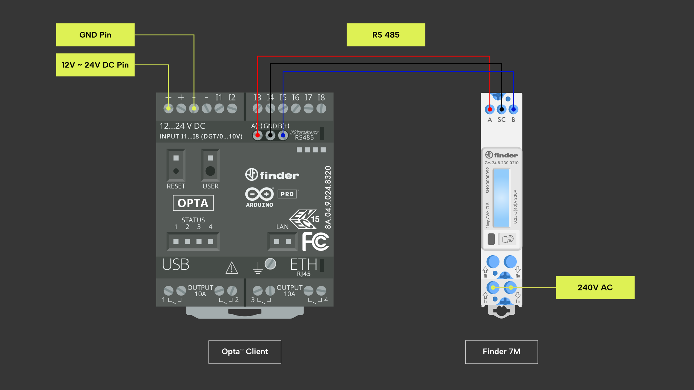

## Panoramica

Finder Opta offre diverse opzioni di interfaccia di comunicazione, tra cui la
porta seriale RS-485. Utilizzando questa porta, è possibile comunicare tramite
il protocollo Modbus RTU. Questo protocollo di comunicazione noto per la sua
efficienza e scalabilità, consente di monitorare dispositivi industriali su
larga scala ed è di fatto uno standard nel settore dell'automazione
industriale. Ciò significa che, una volta collegato ad una serie di
analizzatori di rete che supportano a loro volta il protocollo Modbus RTU,
Finder Opta può essere impiegato come punto focale di un sistema di
monitoraggio e controllo industriale.

Se ad esempio combinassimo Finder Opta con uno o più contatori di energia
Finder serie 7M, potremmo automatizzare la gestione energetica e la
manutenzione predittiva di una linea elettrica. Questo permetterebbe di
ottimizzare l'impianto, monitorandone i consumi e fornendone una panoramica
utile a ridurre i costi operativi.

Per questo motivo, in questo tutorial impareremo a implementare la
comunicazione Modbus RTU tramite RS-485 tra Finder Opta e un contatori di
energia Finder serie 7M. In particolare, impareremo a:

* Utilizzare Finder Opta per leggere i registri di un Finder serie 7M, al fine
  di leggere misure del contatore di energia.
* Utilizzare Finder Opta per convertire i valori letti dai registri del Finder
  serie 7M in valori floating point e caricarli su Arduino Cloud.

Infine presenteremo la libreria `Finder7M`, che permette di semplificare tutte
le operazioni presentate nel corso di questo tutorial.

## Requisiti

### Hardware

* PLC Finder Opta con supporto RS-485 (x1).
* Contatore di energia Finder serie 7M (x1).
* Alimentatore DIN rail 12VDC/500mA (x1).
* Cavo USB-C® (x1).
* Cavo per la connettività RS-485 con una delle seguenti specifiche (x2):
  * STP/UTP 24-18AWG (non terminato) con resistenza di 100-130Ω
  * STP/UTP 22-16AWG (terminato) con resistenza di 100-130Ω

### Software

* [Arduino IDE 2.0+](https://www.arduino.cc/en/software) o [Arduino Web
Editor](https://create.arduino.cc/editor).
* Se si utilizza Arduino IDE offline, è necessario installare le librerie
  `ArduinoRS485` e `ArduinoModbus` utilizzando il Library Manager di Arduino
  IDE.
* Utilizzeremo [Arduino Cloud](https://create.arduino.cc/iot/things) per
  salvare i dati raccolti dal Finder Serie 7M. Per accedere alle funzionalità
  di Arduino Cloud, è richiesta la creazione di un account gratuito. In seguito
  sarà necessario registrare Finder Opta, assegnarlo ad un oggetto e aggiungere
  una proprietà.
* [Sketch di esempio](assets/Opta7MExample.zip).

### Connettività

Per seguire questo tutorial, sarà necessario collegare il contatore di energia
Finder serie 7M alla rete elettrica e fornire un carico adeguato. Sarà inoltre
necessario alimentare il Finder Opta con un alimentatore da 12-24VDC/500mA e
configurare correttamente la connessione seriale RS-485. Il diagramma
sottostante mostra la configurazione corretta dei collegamenti tra il Finder
Opta e il Finder serie 7M.



In questo tutorial i parametri di configurazione utilizzati per la
comunicazione Modbus con il Finder serie 7M sono:

* Indirizzo Modbus: `1`.
* Baudrate: `38400`.
* Configurazione seriale: `8N1`.

Possiamo impostare questi valori tramite NFC utilizzando [l'applicazione Finder
Toolbox](https://www.findernet.com/it/italia/supporto/software-e-app/) .

## Finder serie 7M e il protocollo Modbus

Nella panoramica di questo tutorial abbiamo discusso la possibilità di
utilizzare il protocollo Modbus RTU su connessione seriale RS-485, per
trasformare Finder Opta nel punto focale di un sistema di monitoraggio
industriale composto di contatori di energia Finder serie 7M.

I Finder serie 7M mettono a disposizione una serie di *input register*, a 16
bit ovvero registri dedicati alla memorizzazione di dati che possono essere
letti da altri dispositivi Modbus. Ogni registro è identificato da un indirizzo
ed è possibile accedere al suo contenuto tramite una richiesta.

Come specificato nel documento [Modbus communication protocol
7M](https://cdn.findernet.com/app/uploads/2021/09/20090052/Modbus-7M24-7M38_v2_30062021.pdf),
qualsiasi misura visualizzata sul display del Finder serie 7M può essere
ottenuta via Modbus tramite una serie di letture a 16 bit. Per esempio, la
misura di energia attiva totale è rappresentata da un valore a 32 bit ottenuto
combinando la lettura di due registri da 16 bit adiacenti, situati agli
indirizzi Modbus `30406` e `30407`.

È importante notare che, nei dispositivi Finder Serie 7M, gli offset sono tutti
basati sul *register offset*, non sul *byte offset*. Ciò significa che useremo
gli indirizzi Modbus per indicare la posizione di memoria da cui iniziare a
leggere, specificando il numero di registri che desideriamo leggere a partire
da tale indirizzo. Inoltre, su tali dispositivi, l'indirizzamento Modbus parte
da 1, il che implica che accederemo all'indirizzo Modbus `30406` come *input
register* numero `406`.

Ulteriori informazioni sul protocollo di comunicazione Modbus sono contennute
in [questo articolo sul
protocollo](https://docs.arduino.cc/learn/communication/Modbus). Tutte le
funzionalità fornite dalla libreria `ArduinoModbus` sono supportate da Finder
Opta.

## Istruzioni

### Configurazione dell'Arduino IDE

Per seguire questo tutorial, sarà necessaria [l'ultima versione dell'Arduino
IDE](https://www.arduino.cc/en/software). Se è la prima volta che configuri un
Finder Opta, dai un'occhiata al tutorial [Getting Started with
Opta](/tutorials/opta/getting-started): in questo tutorial spieghiamo come
installare il Board Manager per la piattaforma Mbed OS Opta, ovvero l'insieme
di tool di base necessari a creare e utilizzare uno sketch per Finder Opta con
Arduino IDE.

Assicurati di installare l'ultima versione delle librerie
[ArduinoModbus](https://www.arduino.cc/reference/en/libraries/arduinomodbus/) e
[ArduinoRS485](https://www.arduino.cc/reference/en/libraries/arduinors485/),
poiché verranno utilizzate per implementare il protocollo di comunicazione
Modbus RTU. Inoltre, installa la libreria
[ArduinoIoTCloud](https://www.arduino.cc/reference/en/libraries/arduinoiotcloud/),
necessaria per salvare i dati su Arduino Cloud.

Per una breve spiegazione su come installare manualmente le librerie
all'interno di Arduino IDE, consulta [questo
articolo](https://support.arduino.cc/hc/en-us/articles/5145457742236-Add-libraries-to-Arduino-IDE).

### Panoramica del codice

Lo scopo di questo tutorial è scrivere uno sketch che permetta di leggere
alcune misure da un contatore di energia Finder serie 7M, per poi stamparle su
monitor seriale. Inoltre, la misura di energia attiva totale verrà salvata su
Arduino Cloud. Il codice completo dell'esempio è disponibile
[qui](assets/Opta7MExample.zip). È possibile estrarre il contenuto del file
`.zip` e copiarlo nella cartella ~/Documents/Arduino, o alternativamente creare
un nuovo sketch chiamato `Opta7MExample` utilizzando Arduino IDE ed incollare
il codice presente nel tutorial.

Il file `thingProperties.h` generato automaticamente da Arduino Cloud durante
la configurazione del progetto, è stato leggermente modificato per ottenere le
credenziali dal file `config.h`. Questo permette di separare le impostazioni di
rete dal codice principale. Il file `config.h` definisce i seguenti parametri:

```cpp
#define WIFI_SECRET_SSID "YOUR SSID"
#define WIFI_SECRET_PASSWORD "YOUR PASSWORD"

// Use WiFi to connect to Arduino Cloud
#define ARDUINO_CLOUD_USE_WIFI 1
```

Iniziamo scrivendo un file di configurazione contenente alcune costanti da
utilizzare nello sketch di lettura. In particolare, creiamo un file chiamato
`finder-7m.h` all'interno della stessa cartella dello sketch, e al suo interno
inseriamo:

* I valori da utilizzare per inizializzare la comunicazione Modbus tramite
  porta seriale RS-485, compresi indirizzo di Modbus e baudrate del Finder
  serie 7M.
* Gli indirizzi dei registri del Finder serie 7M da cui leggere le misure.
* Il valore di errore restituito dalla libraria Modbus in caso di errori di
  lettura.

Il file di configurazione deve avere il seguento contenuto:

```cpp
// Configurazione
#define ADDRESS 1
#define BAUDRATE 38400
#define PREDELAY 1750
#define POSTDELAY 1750
#define TIMEOUT 1000

// Registri
#define REG_RUN_TIME 103     // Run time
#define REG_FREQUENCY 105    // Frequency
#define REG_VOLTAGE 107      // Voltage U1
#define REG_ACTIVE_POWER 140 // Active Power
#define REG_ENERGY 406       // Active energy

// Errore di lettura
#define INVALID_DATA 0xFFFFFFFF
```

Passiamo ora a scrivere lo sketch `Opta7MExample`, che come tutti gli sketch
per Arduino sarà composto da una funzione di `setup()` e una funzione `loop()`:

```cpp
void setup()
{
  // Codice di setup, eseguito all'avvio
}

void loop()
{
  // Codice di loop, eseguito all'infinito
}
```

All'inizio del nostro sketch importiamo le librerie ed i file necessari al
funzionamento del programma:

```cpp
#include <Arduino.h>
#include <ArduinoModbus.h>
#include <ArduinoRS485.h>
#include <ArduinoIoTCloud.h>
#include <math.h>
#include "config.h"
#include "finder-7m.h"

void setup()
{
  // Codice di setup, eseguito all'avvio
}

void loop()
{
  // Codice di loop, eseguito all'infinito
}
```

In particolare abbiamo importato le librerie:

* `Arduino`: contiene numerose funzionalità di base per le schede Arduino, ed è
  quindi buona norma importarla all'inizio di tutti gli sketch.
* `ArduinoRS485`: necessaria a inviare e ricevere dati su porta seriale RS-485.
* `ArduinoModbus`: implementa il protocollo Modbus.
* `math`: libreria che contiene funzioni matematiche come necessaria a
  convertire i dati letti dal Finder serie 7M.

Inoltre abbiamo importato i file:

* `config.h`: contiene la configurazione di rete.
* `finder-7m.h`: contiene le costanti da utilizzare nello sketch per leggere
  dal Finder serie 7M.

A questo punto abbiamo tutto il necessario per scrivere la funzione `setup()`,
eseguita una singola volta all'avvio di Finder Opta. Nel nostro caso all'avvio
del programma è necessario eseguire le seguenti operazioni:

* Configurare i parametri di comunicazione seriale, per poter stampare le
  misure lette sul monitor seriale di Arduino IDE.
* Configurare la comunicazione Modbus su seriale RS-485, settandone i parametri
  di configurazione contenuti nelle costanti.

Il codice qui sotto imposta la velocità di trasmissione della comunicazione
seriale a `9600` e in seguito configura timeout e delay della comunicazione
Modbus. Infine inizializza la comunicazione Modbus con baudrate `38400` e
codifica `8N1`, come previsto dal Finder serie 7M:

```cpp
#include <Arduino.h>
#include <ArduinoModbus.h>
#include <ArduinoRS485.h>
#include <ArduinoIoTCloud.h>
#include <math.h>
#include "config.h"
#include "finder-7m.h"

void setup()
{
    Serial.begin(9600);

    RS485.setDelays(PREDELAY, POSTDELAY);
    ModbusRTUClient.setTimeout(TIMEOUT);
    ModbusRTUClient.begin(BAUDRATE, SERIAL_8N1);

    // Codice di setup di Arduino Cloud
}

void loop()
{
  // Codice di loop, eseguito all'infinito
}
```

Passiamo alla funzione di `loop()`, in cui vogliamo leggere alcune misure
contenute nei registri del Finder serie 7M indicando:

* Indirizzo di Modbus del Finder serie 7M.
* Indirizzo del registro da cui iniziare la lettura.
* Numero di bit da leggere cominciando dall'indirizzo di partenza.

In questo esempio, mostriamo come leggere tempo di funzionamento, frequenza,
tensione, potenza attiva ed energia attiva dal Finder serie 7M. Tutte queste
misure sono rappresentate con 32 bit e abbiamo definito come costanti gli
indirizzi degli *input register* che le contengono. La cosa più semplice è
quindi scrivere una funzione che, dato un indirizzo Modbus ed un registro di
partenza legga 32 bit dal dispositivo:

```cpp
#include <Arduino.h>
#include <ArduinoModbus.h>
#include <ArduinoRS485.h>
#include <ArduinoIoTCloud.h>
#include <math.h>
#include "config.h"
#include "finder-7m.h"

void setup()
{
    Serial.begin(9600);

    RS485.setDelays(PREDELAY, POSTDELAY);
    ModbusRTUClient.setTimeout(TIMEOUT);
    ModbusRTUClient.begin(BAUDRATE, SERIAL_8N1);

    // Codice di setup di Arduino Cloud
}

void loop()
{
  // Codice di loop, eseguito all'infinito
}

uint32_t modbus7MRead32(uint8_t address, uint16_t reg)
{
    ModbusRTUClient.requestFrom(address, INPUT_REGISTERS, reg, 2);
    uint32_t data1 = ModbusRTUClient.read();
    uint32_t data2 = ModbusRTUClient.read();
    if (data1 != INVALID_DATA && data2 != INVALID_DATA)
    {
        return data1 << 16 | data2;
    }
    else
    {
        return INVALID_DATA;
    }
}
```

La funzione `modbus7MRead32()` legge dal dispositivo avente indirizzo Modbus
`address`, a partire dal registro `reg`. Si noti che l'ultimo parametro passato
alla funzione `requestFrom()` è il numero di registri consecutivi da leggere, a
partire da `reg`: essendo ogni registro lungo 16 bit ed ogni misura lunga 32
bit il valore passato è `2`. In seguito la funzione verifica che non ci siano
errori di lettura ed in caso affermativo combina le due letture da 16 bit nei
32 bit della misura: il primo valore letto viene posto nei 16 bit meno
significativi, mentre il secondo valore letto viene posto nei 16 bit più
significativi.

Alcuni valori, come il tempo di funzionamento e l'energia attiva, sono
rappresentati come numeri reali a 32 bit (individuabili con i codici `T2` e
`T3` nel documento [Modbus communication protocol
7M](https://cdn.findernet.com/app/uploads/2021/09/20090052/Modbus-7M24-7M38_v2_30062021.pdf))
e possono essere utilizzati senza ulteriori elaborazioni. Tuttavia, altri
valori come la frequenza e la tensione utilizzano un formato di codifica più
complesso che richiede una decodifica prima di poter essere impiegati. Per
questi casi, è necessario scrivere delle funzioni di conversione.

Scriviamo la funzione `convertT5()` per convertire un valore codificato in
formato `T5` in un numero float. Come descritto nel documento [Modbus
communication protocol
7M](https://cdn.findernet.com/app/uploads/2021/09/20090052/Modbus-7M24-7M38_v2_30062021.pdf),
il formato `T5` suddivide i 32 bit nel seguente modo:

* Gli 8 bit più significativi rappresentano un esponente con segno (-128 a
  127).
* I 24 bit meno significativi costituiscono la mantissa, un numero senza segno.

Il codice dovrà estrarre l'esponente `e`, determinarne il segno e poi elevare
la mantissa `m` alla potenza di `e` utilizzando la funzione `pow()`,
restituendo infine il risultato come float:

```cpp
#include <Arduino.h>
#include <ArduinoModbus.h>
#include <ArduinoRS485.h>
#include <ArduinoIoTCloud.h>
#include <math.h>
#include "config.h"
#include "finder-7m.h"

void setup()
{
    Serial.begin(9600);

    RS485.setDelays(PREDELAY, POSTDELAY);
    ModbusRTUClient.setTimeout(TIMEOUT);
    ModbusRTUClient.begin(BAUDRATE, SERIAL_8N1);

    // Codice di setup di Arduino Cloud
}

void loop()
{
  // Codice di loop, eseguito all'infinito
}

uint32_t modbus7MRead32(uint8_t address, uint16_t reg)
{
    ModbusRTUClient.requestFrom(address, INPUT_REGISTERS, reg, 2);
    uint32_t data1 = ModbusRTUClient.read();
    uint32_t data2 = ModbusRTUClient.read();
    if (data1 != INVALID_DATA && data2 != INVALID_DATA)
    {
        return data1 << 16 | data2;
    }
    else
    {
        return INVALID_DATA;
    }
}

float convertT5(uint32_t n)
{
    uint32_t s = (n & 0x80000000) >> 31;
    int32_t e = (n & 0x7F000000) >> 24;
    if (s == 1)
    {
        e = e - 0x80;
    }
    uint32_t m = n & 0x00FFFFFF;
    return (float)m * pow(10, e);
}
```

Allo stesso modo scriviamo la funzione `convertT6()` per convertire un valore
codificato in formato `T6` in un numero float. In questo caso la mantissa è un
valore con segno:

```cpp
#include <Arduino.h>
#include <ArduinoModbus.h>
#include <ArduinoRS485.h>
#include <ArduinoIoTCloud.h>
#include <math.h>
#include "config.h"
#include "finder-7m.h"

void setup()
{
    Serial.begin(9600);

    RS485.setDelays(PREDELAY, POSTDELAY);
    ModbusRTUClient.setTimeout(TIMEOUT);
    ModbusRTUClient.begin(BAUDRATE, SERIAL_8N1);

    // Codice di setup di Arduino Cloud
}

void loop()
{
  // Codice di loop, eseguito all'infinito
}

uint32_t modbus7MRead32(uint8_t address, uint16_t reg)
{
    ModbusRTUClient.requestFrom(address, INPUT_REGISTERS, reg, 2);
    uint32_t data1 = ModbusRTUClient.read();
    uint32_t data2 = ModbusRTUClient.read();
    if (data1 != INVALID_DATA && data2 != INVALID_DATA)
    {
        return data1 << 16 | data2;
    }
    else
    {
        return INVALID_DATA;
    }
}

float convertT5(uint32_t n)
{
    uint32_t s = (n & 0x80000000) >> 31;
    int32_t e = (n & 0x7F000000) >> 24;
    if (s == 1)
    {
        e = e - 0x80;
    }
    uint32_t m = n & 0x00FFFFFF;
    return (float)m * pow(10, e);
}

float convertT6(uint32_t n)
{
    uint32_t s = (n & 0x80000000) >> 31;
    int32_t e = (n & 0x7F000000) >> 24;
    if (s == 1)
    {
        e = e - 0x80;
    }
    uint32_t ms = (n & 0x00800000) >> 23;
    int32_t mv = (n & 0x007FFFFF);
    if (ms == 1)
    {
        mv = mv - 0x800000;
    }
    return (float)mv * pow(10, e);
}
```

Con queste funzioni a disposizione, possiamo procedere con la scrittura del
codice per la funzione `loop()`. La funzione `loop()` si occuperà di chiamare
`modbus6MRead32()` con i parametri corretti e successivamente di stampare le
misure sul monitor seriale utilizzando le funzioni di conversione.

```cpp
#include <Arduino.h>
#include <ArduinoModbus.h>
#include <ArduinoRS485.h>
#include <ArduinoIoTCloud.h>
#include <math.h>
#include "config.h"
#include "finder-7m.h"

void setup()
{
    Serial.begin(9600);

    RS485.setDelays(PREDELAY, POSTDELAY);
    ModbusRTUClient.setTimeout(TIMEOUT);
    ModbusRTUClient.begin(BAUDRATE, SERIAL_8N1);

    // Codice di setup di Arduino Cloud
}

void loop()
{
    uint32_t runTime = modbus7MRead32(ADDRESS, REG_RUN_TIME);
    uint32_t energy = modbus7MRead32(ADDRESS, REG_ENERGY);
    uint32_t frequency = modbus7MRead32(ADDRESS, REG_FREQUENCY);
    uint32_t voltage = modbus7MRead32(ADDRESS, REG_VOLTAGE);
    uint32_t activePower = modbus7MRead32(ADDRESS, REG_ACTIVE_POWER);

    Serial.print("Run time = " + (runTime != INVALID_DATA ? String(runTime) : String("read error")));
    Serial.print(", Energy = " + (energy != INVALID_DATA ? String((float)energy) : String("read error!")));
    Serial.print(", Frequency = " + (frequency != INVALID_DATA ? String(convertT5(energy)) : String("read error!")));
    Serial.print(", Voltage = " + (voltage != INVALID_DATA ? String(convertT5(voltage)) : String("read error!")));
    Serial.println(", Active power = " + (activePower != INVALID_DATA ? String(convertT6(activePower)) : String("read error!")));

    // Codice che invia il valore di energia ad Arduino Cloud

    delay(1000);
}

uint32_t modbus7MRead32(uint8_t address, uint16_t reg)
{
    ModbusRTUClient.requestFrom(address, INPUT_REGISTERS, reg, 2);
    uint32_t data1 = ModbusRTUClient.read();
    uint32_t data2 = ModbusRTUClient.read();
    if (data1 != INVALID_DATA && data2 != INVALID_DATA)
    {
        return data1 << 16 | data2;
    }
    else
    {
        return INVALID_DATA;
    }
}

float convertT5(uint32_t n)
{
    uint32_t s = (n & 0x80000000) >> 31;
    int32_t e = (n & 0x7F000000) >> 24;
    if (s == 1)
    {
        e = e - 0x80;
    }
    uint32_t m = n & 0x00FFFFFF;
    return (float)m * pow(10, e);
}

float convertT6(uint32_t n)
{
    uint32_t s = (n & 0x80000000) >> 31;
    int32_t e = (n & 0x7F000000) >> 24;
    if (s == 1)
    {
        e = e - 0x80;
    }
    uint32_t ms = (n & 0x00800000) >> 23;
    int32_t mv = (n & 0x007FFFFF);
    if (ms == 1)
    {
        mv = mv - 0x800000;
    }
    return (float)mv * pow(10, e);
}
```

Nell'ordine stamperemo su monitor seriale:

* Il tempo di funzionamento del Finder serie 7M (s).
* Il contatore di energia attiva totale (kWh).
* La frequenza (Hz).
* La tensione (V).
* La potenza attiva (W).

Sul monitor seriale di Arduino IDE dovremmo vedere un output di questo tipo
ripetuto una volta al secondo:

```text
Run time = 123456, Energy = 400.00, Frequency = 49.9, Voltage = 230.0, Active power = 100.0
```

Aggiungiamo ora il codice che invia il valore di energia attiva al cloud. Dopo
aver aggiunto la proprietà `cloudEnergy`, creiamo un file chiamato
`thingProperties.h` all'interno della stessa cartella dello sketch e al suo
interno copiamo il codice generato dall'IDE Cloud nel file `thingProperties.h`.

In seguito apportiamo alcune modifiche al file `thingProperties.h` per leggere
le credenziali di rete dal file `config.h`:

```cpp
#include <ArduinoIoTCloud.h>
#include <Arduino_ConnectionHandler.h>
#include "config.h"

const char SSID[] = WIFI_SECRET_SSID;
const char PASS[] = WIFI_SECRET_PASSWORD;

float cloudEnergy;

void initProperties()
{
    ArduinoCloud.addProperty(cloudEnergy, Permission::Read);
}

#if ARDUINO_CLOUD_USE_WIFI == 1
WiFiConnectionHandler ArduinoIoTPreferredConnection(SSID, PASS);
#else
EthernetConnectionHandler ArduinoIoTPreferredConnection;
#endif
```

Importiamo il file `thingProperties.h` nello sketch principale e inizializziamo
Arduino Cloud nella funzione `setup()`:

```cpp
#include <Arduino.h>
#include <ArduinoModbus.h>
#include <ArduinoRS485.h>
#include <math.h>
#include "finder-7m.h"
#include "config.h"
#include "thingProperties.h"

void setup()
{
    Serial.begin(9600);

    RS485.setDelays(PREDELAY, POSTDELAY);
    ModbusRTUClient.setTimeout(TIMEOUT);
    ModbusRTUClient.begin(BAUDRATE, SERIAL_8N1);

    initProperties();
    ArduinoCloud.begin(ArduinoIoTPreferredConnection);
}

void loop()
{
    uint32_t runTime = modbus7MRead32(ADDRESS, REG_RUN_TIME);
    uint32_t energy = modbus7MRead32(ADDRESS, REG_ENERGY);
    uint32_t frequency = modbus7MRead32(ADDRESS, REG_FREQUENCY);
    uint32_t voltage = modbus7MRead32(ADDRESS, REG_VOLTAGE);
    uint32_t activePower = modbus7MRead32(ADDRESS, REG_ACTIVE_POWER);

    Serial.print("Run time = " + (runTime != INVALID_DATA ? String(runTime) : String("read error")));
    Serial.print(", Energy = " + (energy != INVALID_DATA ? String((float)energy) : String("read error!")));
    Serial.print(", Frequency = " + (frequency != INVALID_DATA ? String(convertT5(energy)) : String("read error!")));
    Serial.print(", Voltage = " + (voltage != INVALID_DATA ? String(convertT5(voltage)) : String("read error!")));
    Serial.println(", Active power = " + (activePower != INVALID_DATA ? String(convertT6(activePower)) : String("read error!")));

    // Codice che invia il valore di energia ad Arduino Cloud

    delay(1000);
}

uint32_t modbus7MRead32(uint8_t address, uint16_t reg)
{
    ModbusRTUClient.requestFrom(address, INPUT_REGISTERS, reg, 2);
    uint32_t data1 = ModbusRTUClient.read();
    uint32_t data2 = ModbusRTUClient.read();
    if (data1 != INVALID_DATA && data2 != INVALID_DATA)
    {
        return data1 << 16 | data2;
    }
    else
    {
        return INVALID_DATA;
    }
}

float convertT5(uint32_t n)
{
    uint32_t s = (n & 0x80000000) >> 31;
    int32_t e = (n & 0x7F000000) >> 24;
    if (s == 1)
    {
        e = e - 0x80;
    }
    uint32_t m = n & 0x00FFFFFF;
    return (float)m * pow(10, e);
}

float convertT6(uint32_t n)
{
    uint32_t s = (n & 0x80000000) >> 31;
    int32_t e = (n & 0x7F000000) >> 24;
    if (s == 1)
    {
        e = e - 0x80;
    }
    uint32_t ms = (n & 0x00800000) >> 23;
    int32_t mv = (n & 0x007FFFFF);
    if (ms == 1)
    {
        mv = mv - 0x800000;
    }
    return (float)mv * pow(10, e);
}
```

Infine, nel `loop()` assegniamo il valore di energia alla variabile
`cloudEnergy` e lo inviamo ad Arduino Cloud:

```cpp
#include <Arduino.h>
#include <ArduinoModbus.h>
#include <ArduinoRS485.h>
#include <math.h>
#include "finder-7m.h"
#include "config.h"
#include "thingProperties.h"

void setup()
{
    Serial.begin(9600);

    RS485.setDelays(PREDELAY, POSTDELAY);
    ModbusRTUClient.setTimeout(TIMEOUT);
    ModbusRTUClient.begin(BAUDRATE, SERIAL_8N1);

    initProperties();
    ArduinoCloud.begin(ArduinoIoTPreferredConnection);
}

void loop()
{
    uint32_t runTime = modbus7MRead32(ADDRESS, REG_RUN_TIME);
    uint32_t energy = modbus7MRead32(ADDRESS, REG_ENERGY);
    uint32_t frequency = modbus7MRead32(ADDRESS, REG_FREQUENCY);
    uint32_t voltage = modbus7MRead32(ADDRESS, REG_VOLTAGE);
    uint32_t activePower = modbus7MRead32(ADDRESS, REG_ACTIVE_POWER);

    Serial.print("Run time = " + (runTime != INVALID_DATA ? String(runTime) : String("read error")));
    Serial.print(", Energy = " + (energy != INVALID_DATA ? String((float)energy) : String("read error!")));
    Serial.print(", Frequency = " + (frequency != INVALID_DATA ? String(convertT5(energy)) : String("read error!")));
    Serial.print(", Voltage = " + (voltage != INVALID_DATA ? String(convertT5(voltage)) : String("read error!")));
    Serial.println(", Active power = " + (activePower != INVALID_DATA ? String(convertT6(activePower)) : String("read error!")));

    if (energy != INVALID_DATA)
    {
        cloudEnergy = (float)energy;
        ArduinoCloud.update();
    }

    delay(1000);
}

uint32_t modbus7MRead32(uint8_t address, uint16_t reg)
{
    ModbusRTUClient.requestFrom(address, INPUT_REGISTERS, reg, 2);
    uint32_t data1 = ModbusRTUClient.read();
    uint32_t data2 = ModbusRTUClient.read();
    if (data1 != INVALID_DATA && data2 != INVALID_DATA)
    {
        return data1 << 16 | data2;
    }
    else
    {
        return INVALID_DATA;
    }
}

float convertT5(uint32_t n)
{
    uint32_t s = (n & 0x80000000) >> 31;
    int32_t e = (n & 0x7F000000) >> 24;
    if (s == 1)
    {
        e = e - 0x80;
    }
    uint32_t m = n & 0x00FFFFFF;
    return (float)m * pow(10, e);
}

float convertT6(uint32_t n)
{
    uint32_t s = (n & 0x80000000) >> 31;
    int32_t e = (n & 0x7F000000) >> 24;
    if (s == 1)
    {
        e = e - 0x80;
    }
    uint32_t ms = (n & 0x00800000) >> 23;
    int32_t mv = (n & 0x007FFFFF);
    if (ms == 1)
    {
        mv = mv - 0x800000;
    }
    return (float)mv * pow(10, e);
}
```

## Utilizzo della libreria Finder7M

Per semplificare tutte le operazioni che abbiamo eseguito in questo tutorial, è
possibile utilizzare la libreria `Finder7M`. In questo caso, il codice di
`setup()` dello sketch diventa molto più semplice, poiché la libreria fornisce
funzioni integrate per configurare i parametri Modbus:

```cpp
#include <Arduino.h>
#include <ArduinoModbus.h>
#include <ArduinoRS485.h>
#include <Finder7M.h>
#include <math.h>
#include "finder-7m.h"
#include "config.h"
#include "thingProperties.h"

Finder7M f7m;

void setup()
{
    Serial.begin(9600);

    f7m.init(BAUDRATE);

    // Codice di setup di Arduino Cloud
}

void loop()
{
    // Codice di loop, eseguito all'infinito
}
```

Anche il codice nel `loop()` diventa più semplice, e non è più necessario
scrivere funzioni per interagire con i registri, conoscere gli indirizzi dei
registri o decodificare i valori letti dal Finder serie 7M:

```cpp
#include <Arduino.h>
#include <Finder7M.h>
#include "finder-7m.h"
#include "config.h"
#include "thingProperties.h"

Finder7M f7m;

void setup()
{
    Serial.begin(9600);

    f7m.init(BAUDRATE);

    // Codice di setup di Arduino Cloud
}

void loop()
{
    Measure runTime = f7m.getRunTime(ADDRESS);
    Measure energy = f7m.getMIDInActiveEnergy(ADDRESS);
    Measure frequency = f7m.getFrequency(ADDRESS);
    Measure voltage = f7m.getVoltage(ADDRESS);
    Measure activePower = f7m.getActivePowerTotal(ADDRESS);
    
    Serial.print("Run time = " + (runTime.isReadError() ? String("read error") : String(runTime.toFloat())));
    Serial.print(", Energy = " + (energy.isReadError() ? String("read error") : String(energy.toFloat())));
    Serial.print(", Frequency = " + (frequency.isReadError() ? String("read error") : String(frequency.toFloat())));
    Serial.print(", Voltage = " + (voltage.isReadError() ? String("read error") : String(voltage.toFloat())));
    Serial.println(", Active power = " + (activePower.isReadError() ? String("read error") : String(activePower.toFloat())));

    // Codice che invia il valore di energia ad Arduino Cloud

    delay(1000);
}
```

Per saperne di più sulla libreria, visita la [repository
ufficiale](https://github.com/dndg/Finder7M).

## Lettura da più dispositivi Finder serie 7M

Se desideriamo leggere dai registri di più Finder serie 7M, possiamo
inizializzare nello sketch un array contenente gli indirizzi Modbus dei
dispositivi con cui vogliamo interagire. Nella funzione `loop()` possiamo
iterare con un ciclo `for` e utilizzare la libreria `Finder7M` per effettuare
le letture:

```cpp
#include <Arduino.h>
#include <Finder7M.h>
#include "finder-7m.h"
#include "config.h"
#include "thingProperties.h"

Finder7M f7m;

const uint8_t addresses[4] = {6, 10, 11, 13};

void setup()
{
    Serial.begin(9600);

    f7m.init(BAUDRATE);

    // Codice di setup di Arduino Cloud
}

void loop()
{
    for (int i = 0; i < sizeof(addresses); i++)
    {
        Measure runTime = f7m.getRunTime(i);
        Measure energy = f7m.getMIDInActiveEnergy(i);
        Measure frequency = f7m.getFrequency(i);
        Measure voltage = f7m.getVoltage(i);
        Measure activePower = f7m.getActivePowerTotal(i);
    
        Serial.print("Reading from Finder 7M with address " + String(addresses[i]));
        Serial.print(". Run time = " + (runTime.isReadError() ? String("read error") : String(runTime.toFloat())));
        Serial.print(", Energy = " + (energy.isReadError() ? String("read error") : String(energy.toFloat())));
        Serial.print(", Frequency = " + (frequency.isReadError() ? String("read error") : String(frequency.toFloat())));
        Serial.print(", Voltage = " + (voltage.isReadError() ? String("read error") : String(voltage.toFloat())));
        Serial.println(", Active power = " + (activePower.isReadError() ? String("read error") : String(activePower.toFloat())));
    }

    // Codice che invia il valore di energia ad Arduino Cloud

    delay(1000);
}
```

## Conclusioni

In questo tutorial abbiamo imparato ad implementare la comunicazione Modbus
tramite porta seriale RS-485 tra un Finder Opta ed un contatore di energia
Finder serie 7M. Attraverso esempi pratici, abbiamo visto come leggere misure
da uno o più Finder serie 7M. Inoltre, abbiamo mostrato come inviare i valori
letti ad Arduino Cloud. Infine abbiamo presentato la libreria Finder7M per
semplificare ulteriormente queste operazioni.

Con le conoscenze acquisite sarà possibile implementare soluzioni di
monitoraggio e analisi delle reti industriale, impiegando Finder Opta come
fulcro di un sistema composto da multipli contatori di energia Finder serie 7M.
